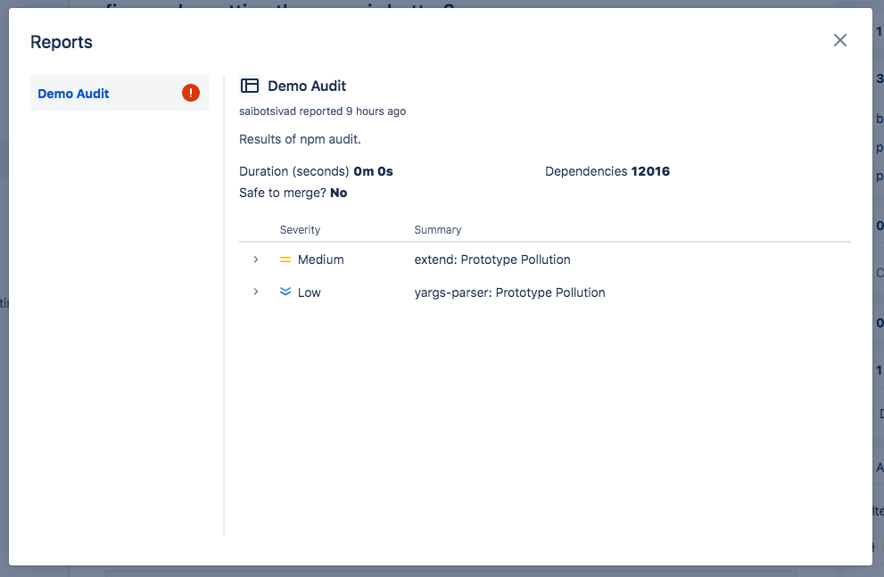

# bpr-npm-audit

Bitbucket Pipelines added [reports](https://confluence.atlassian.com/bitbucket/code-insights-994316785.html) as a feature in pull requests.

With this module, you can get the results of `npm audit` as a report, with *zero configuration*, using `npx`:

```yaml
pipelines:
  my-pipeline:
    - step:
        script:
          - npx bpr-npm-audit
```

Have a look at this [example pull request](https://bitbucket.org/saibotsivad/test-bpr-npm-audit/pull-requests/1/fix-maybe-setting-the-proxy-is-better), which generates a report like this:



## security

This module has zero dependencies (outside of NodeJS), and is simple enough to audit yourself.

If you are very paranoid, I recommend forking this repository, auditing the forked code, and then using `npx` pointed to your fork:

```yaml
pipelines:
  my-pipeline:
    - step:
        script:
          - npx username/bpr-npm-audit
```

(Where `username` is your Github username.)

## configure

Parameters are passed in as environment variables. For example:

```yaml
pipelines:
  my-pipeline:
    - step:
        script:
          - BPR_NAME="My Report" BPR_ID="myid" BPR_LEVEL="low" BPR_MAX_BUFFER_SIZE="20971520" npx bpr-npm-audit
```

### proxy

Configure by setting the environment variable `BPR_PROXY` to one of these options.

* `local` - (default) used in normal Pipelines
* `pipe` - used in custom pipes

### report name

Configure by setting the environment variable `BPR_NAME`.

Default: `Security: npm audit`

### report id

Configure by setting the environment variable `BPR_ID`.

Default: `npmaudit`

### fail condition

Configure by setting the environment variable `BRP_LEVEL` to one of these options.

* `low`
* `moderate`
* `high` (the default)
* `critical`

If there are any vulnerabilities at that level or higher, the report will be marked as failed.

### max buffer size

Configure by setting the environment variable `BPR_MAX_BUFFER_SIZE` to desired value in bytes.

Default: `10485760` (10 MB)

The value shouldn't be changed unless you run into problems with `npm audit` output being too large to handle
(usually signalled by `Unexpected end of JSON input` error).

## license

This project is published and released under the [Very Open License](http://veryopenlicense.com).

---

(Made with ❤️ by [Tobias Davis](https://davistobias.com).)
